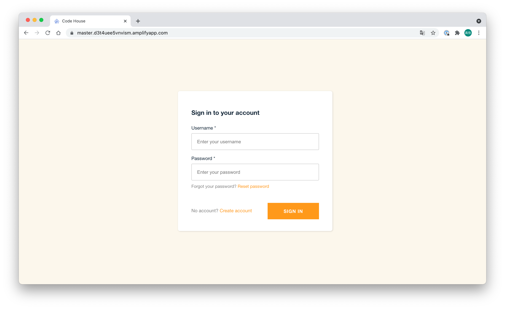
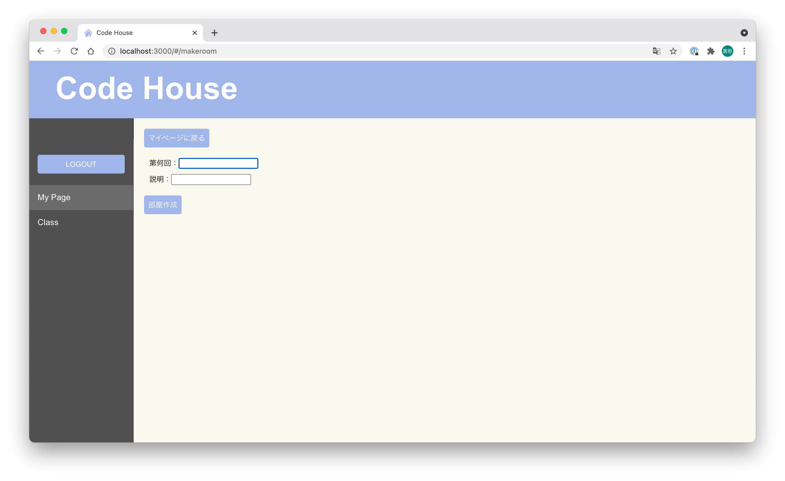
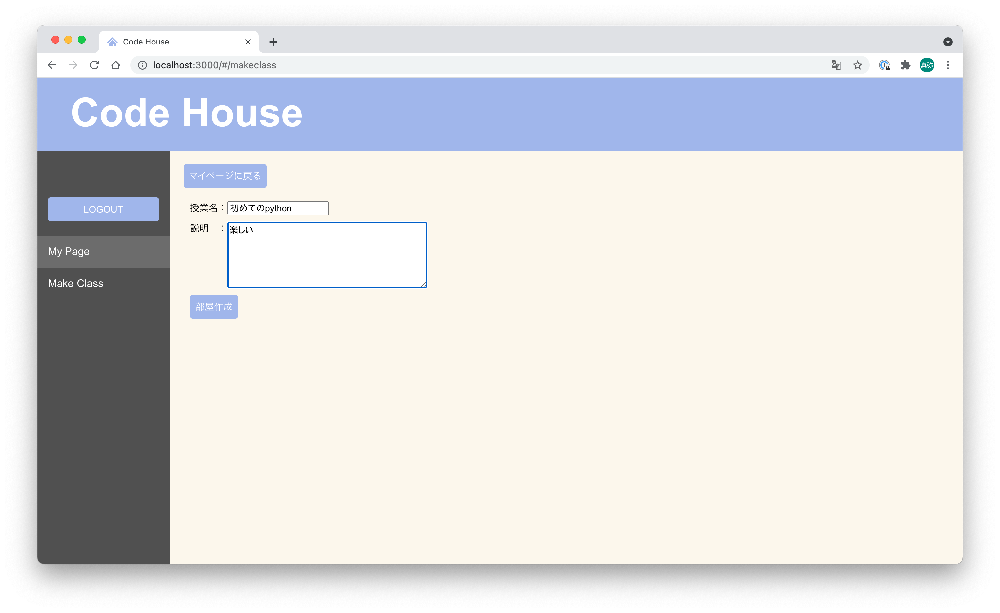
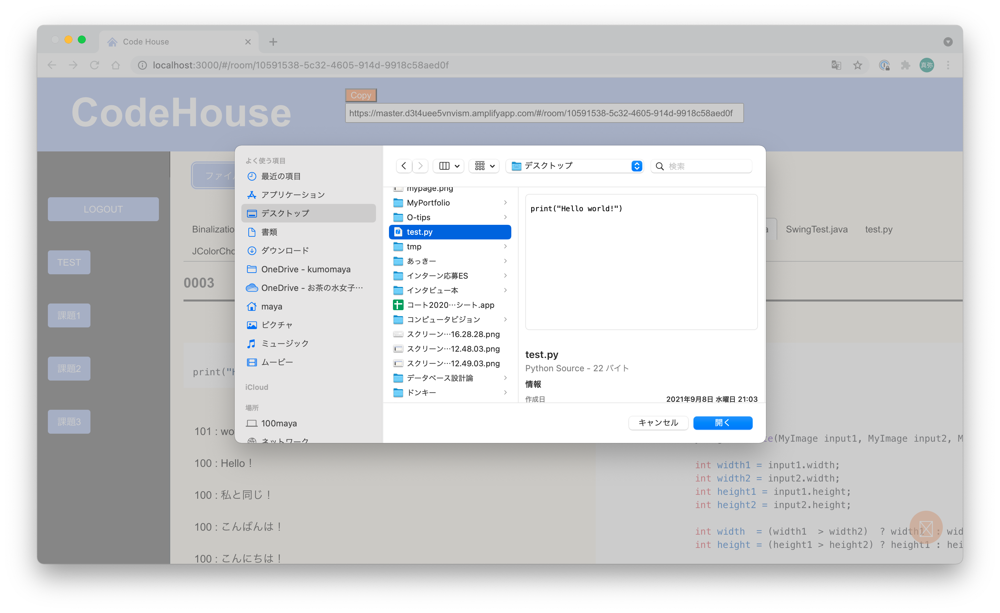
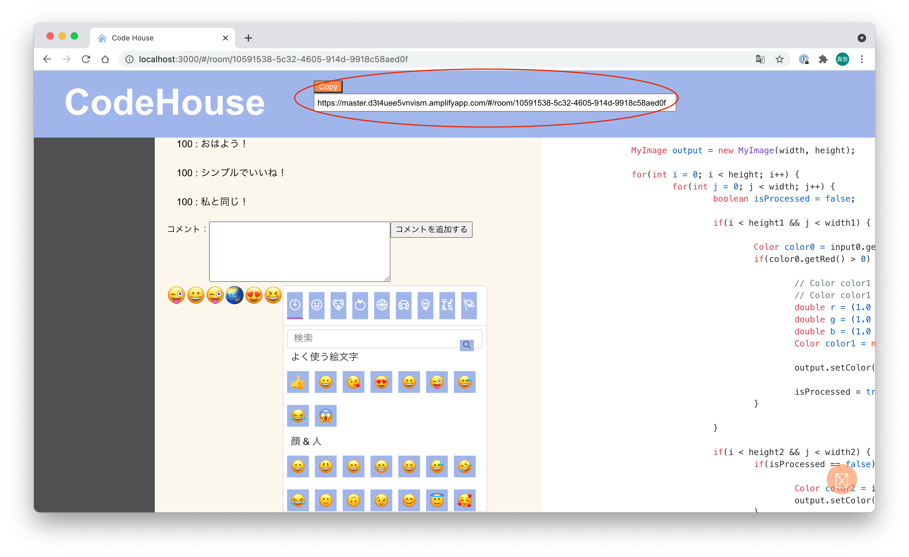
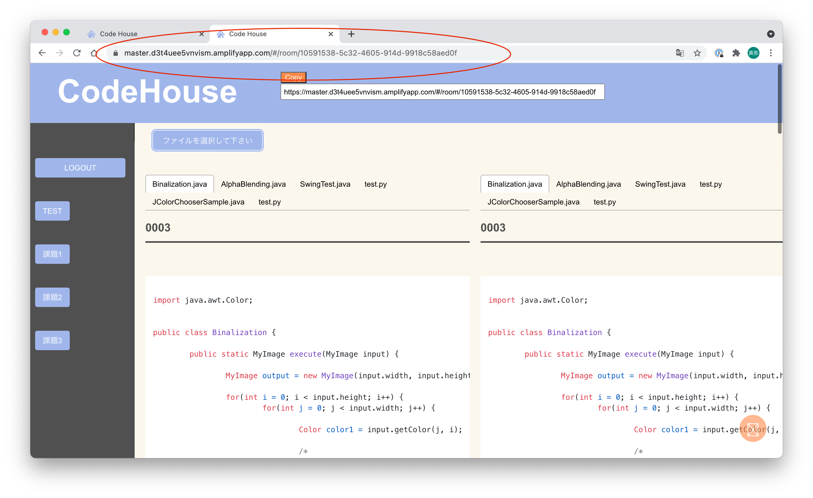
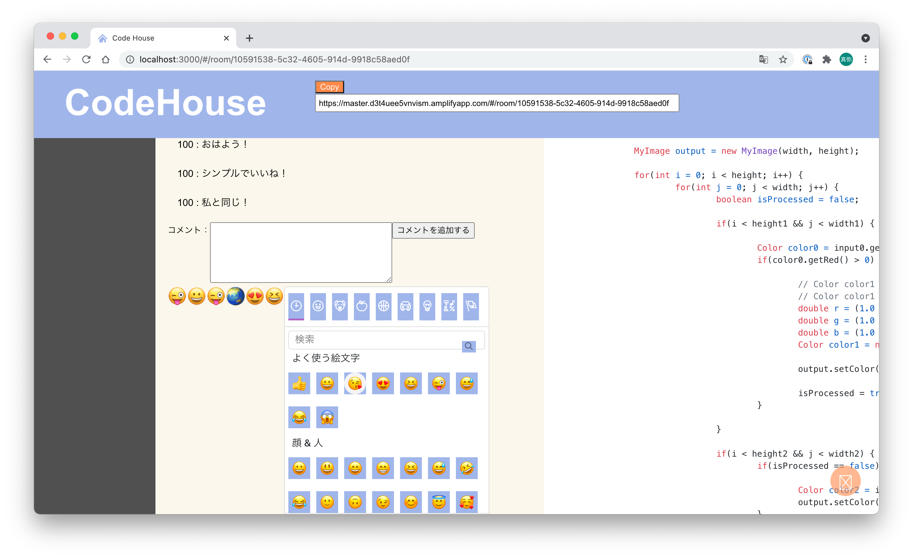

# Code House
### 作品
- [ホスト先](https://master.d3t4uee5vnvism.amplifyapp.com/ "ホスト")

### 概要
簡単なコード共有のためのwebアプリです！同じ授業を受けている人たちで手軽に共有し合って、プログラミングの授業をより楽しく効果的に受けることができます。情報系の一年生や、いろいろな学部の人たちに使ってほしい作品です。

## 使い方
1. ログインします(create accountでアカウントを作成します)

2. 授業部屋(class)を作成します

3. classの中にroomを作成します

4. roomにファイルをアップロードします

5. 共有したい人にroomのurlを共有します

6. 開くと同じ画面が表示されます

7. コメントや絵文字をつけることができます

